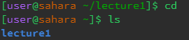
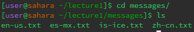
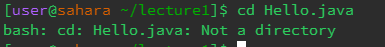
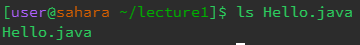
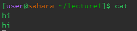
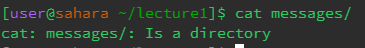

## cd 
 \
When using cd with no arguments inside lecture1 as our working directory, we seem to move out of the lecture1 directory and back into directory of ~ which is where we find lecture1 in the first place.
This is a functionality of cd, since it is how we are able to go all the way to our home directory if we need to access something else inside of it that isn't in our working directory. This is definitely not an error,
as this is definitely how we are supposed to traverse our filesystem backwards. \
 \
While inside the working directory of lecture1, I used the command cd with the directory messages as the argument. This moved me inside the directory of messages, changing the workign directory from lecture1 to
messages. I now am able to see what is inside the directory of messages instead of lecture1 when I use the command ls. This output is not an error, as cd is used to move between directories. \
 \
While working from the working directory of lecture1, I used the command cd with the file Hello.java as the arguement. This prompted the terminal to give me an error as an output by stating that Hello.java was not a
directory. This is because cd is only used to move between directories and cannot be used to move into files. cd is not meant to be used on files, as they are not directories. \
## ls
 \
When using ls with no arguments inside the working directory of lecture1, the terminal outputs a list of files and directories that can be found inside the lecture1 directory. This is because ls is used to list what is inside a directory or file, so when you don't specify what directory you want it to list, it will just list the directory you currently are working in. This is output is not an error, as this is the functionality
of ls. \
 \
While inside the working directory of lecture1, I used ls with the directory of messages as the argument. This gave me a different output than the previous time I used ls, as instead of listing the files and directories
inside the working directory, it instead listed the files and directories inside the messages directory. This is because I gave it the argument of messages, which made the terminal list the contents of messages 
instead. This is not an error, as ls is supposed to list the directory since I specified it to do so. \
 \
After using ls on the file Hello.java inside the working directory of lecture1, the terminal outputted the file Hello.java. This is probably because Hello.java is not a directory, so it doesn't really store any other files
or directoroes inside of it. So, when using the ls command on it, it only outputs the name of itself. This isn't an error, as the only thing that can be listed inside Hello.java is itself. \
## cat
 \
When using cat with no arguments inside lecture1 as our working directory, the terminal seems to allow me to input text into the terminal. It then outputs whatever I type in. This is probably not an error, as cat is used
to read a file and outputs its contents. Since I didn't give it a file to read, it just outputted whatever I inputted into the terminal as text. \
 \
While inside the working directory of lecture1, I used the command cat with the directory messages as the argument. This outputted an error in the terminal that stated messages was a directory. This is because cat only works
with files, so when I tried to use it with its argument being a directory, it couldn't read anything in the file since there was no file to read. \
 \
While inside our working directory of messages, I inputted the cat command into the terminal with the file en-us.txt. This outputted "Hello World!" inside of the terminal. This is because cat reads files and outputs its 
contents. Since en-us.txt contained the text "Hello World!", the cat command outputted "Hello World!". This is not an error, as this is the intended purpose of the cat command.

