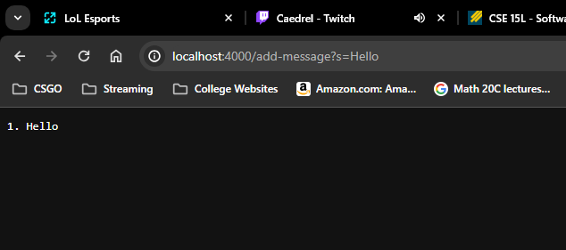
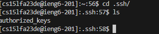
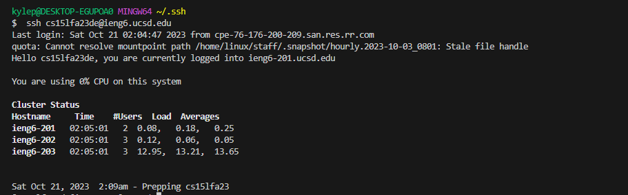

## Part 1

---
 \
The method in my code that is called is `handleRequest(URI url)`, which is used to parse the URL so that it can figure out what operation it wants to use. The code for it is here:
```
if (url.getPath().contains("/add-message")) {
                String[] parameters = url.getQuery().split("=");
                if (parameters[0].equals("s")) {
                    counter++;
                    words += String.valueOf(counter) + ". " + parameters[1] + "\n";
                    return words;
                }
            }
```
This code checks to see if `/add-message` is in the path of the URL. Since in this case `/add-message` does exist in the URL, the code will split the query into an array called `parameters`, putting whatever came before the `=` in the query in index 0 and whatever came
after the `=` in index 1 of paramenters. The first index of `parameters` will tell my code what to do next. Since its `s` in this case, my code will then increment the variable `counter`, a variable which I initialized earlier in order for it to keep track
of the number of words/phrases that were being added to the variable `words`. After incrementing, my code takes the variable `words` and adds whatever was in index 1 of `parameters` to words, along with the number from `counter` to denote which phrase came first.
Additionally, a new line is added to the end so that the next word/phrase added will show up on the next line instead of the same one. In the case in the picture above, the `String` in `parameters[1]` would be `"Hello"`. Thus, `counter` would be incremented to 1 and words
would have the `String "1. Hello\n"` added to it. Finally my code returns `words`, which then is displayed on the browser. \
 \
Just like in the previous example, `handleRequest(URI url)` is the method used to parse the URL and store the desired `String`. Again, the code will take and split the query into two, with index 0 holding everything before `=` and index 1 holding everything after `=`.
Since `s` is in index 0, the code will increment `counter` and add the `String` to `words` along with a new line at the end and the number from counter to denote how early it was added to list. The difference between the previous case and the current case is that `counter`
and `words` already are storing something, as `counter` = 1 and `words` = `"1. Hello\n"`. So, instead of adding to an empty `words` and `counter` variables, this second case adds to it by incrementing `counter` again to 2 and adding `"2. How was your day\n"` to `words`.
The end product is that `counter` is equal to 2 and words is storing the `String` `"1. Hello\n2. How was your day\n"`, which makes them look like a list when on the web browser.

## Part 2




## Part 3
I didn't know that URL's were so similar to paths in the terminal. Just like in the terminal, you can traverse between web pages by moving through the directories they are in by using `/` just like you do in the terminal. I also learned how the query inside a URL can be
alllow you to interface with code that can make things happen such as incrementing a counter or storing words inside of a `String`. I also learned about how we can send files from our local repository to a remote repository like ieng6. All in all, I think I have learned
a lot about how servers work and how to use URL's.
