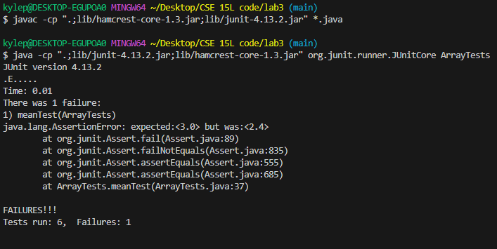

# Part 1
```
 @Test
  public void meanTest() {
    double[] input1 = {3,3,3,3,2,2};
    double output = ArrayExamples.averageWithoutLowest(input1);
    assertEquals(3.0, output, 0.01);
  }
```

```
@Test
public void workingTest() {
    double[] input1 = {1,3,4,2};
    double output = ArrayExamples.averageWithoutLowest(input1);
    assertEquals(3.0, output, 0.01);
  }
```


## Before
```
static double averageWithoutLowest(double[] arr) {
    if(arr.length < 2) { return 0.0; }
    double lowest = arr[0];
    for(double num: arr) {
      if(num < lowest) { lowest = num; }
    }
    double sum = 0;
    for(double num: arr) {
      if(num != lowest) { sum += num; }
    }
    return sum / (arr.length - 1);
  }
```

## After
```
static double averageWithoutLowest(double[] arr) {
    if(arr.length < 2) { return 0.0; }
    double lowest = arr[0];
    for(double num: arr) {
      if(num < lowest) { lowest = num; }
    }
    double sum = 0;
    int counter = 0;
    for(double num: arr) {
      if(num != lowest) { 
        sum += num; 
        counter++;
      }
    }
    return sum / counter;
  }
```
Adding a counter for how many values aren't the lowest number in the array fixes the bug since it will correctly calculate the average of the numbers when there are multiple copies of the smallest number. Before,
the code would calculate the average by dividing the total sum of the numbers in the array by `arr.length - 1`, which only work if there is only one copy of the smallest number in the array. If there are multiple, this code will only account for the removal of one of them. The new code keeps track of the number of numbers that aren't the smallest and then calculate the average by dividing that by the amount of numbers actually summed. This way, the code correctly averages the numbers minus the smallest.

# Part 2


## Listing directories and subdirectories
Source:[https://www.redhat.com/sysadmin/linux-find-command](https://www.redhat.com/sysadmin/linux-find-command)
```
$ find . -type d
.
./911report
./biomed
./government
./government/About_LSC
./government/Alcohol_Problems
./government/Env_Prot_Agen
./government/Gen_Account_Office
./government/Media
./government/Post_Rate_Comm
./plos
```
This command takes the current directory and list all directories and subdireectories inside of it. This can be useful for finding what is actually contained in a directory, especially when there is a lot of other things inside 
```
$ find ./government/ -type d
./government/
./government/About_LSC
./government/Alcohol_Problems
./government/Env_Prot_Agen
./government/Gen_Account_Office
./government/Media
./government/Post_Rate_Comm
```
This command goes more specifically into the `government` directory and list all of the subdirectories inside `government`. This command could be useful in finding what is stored inside of a directory so you can find what you need quickly.

## Find By Content
Source:[https://www.redhat.com/sysadmin/linux-find-command](https://www.redhat.com/sysadmin/linux-find-command)
```
$ find ./biomed/ -name "*txt" -exec grep -Hi CATCGAT {} \;
./biomed/1471-213X-2-8.txt:          CATCGAT, which led to abrogation of the Wnt-3A
```
This command searches the given directory for all text files that include the phrase `CATCGAT` and prints the line that it appears on in the file. This can be used to parse through files and find the one you are looking for faster since it will tell you the files that include the content that you want.

```
$ find ./plos/ -name "*txt" -exec grep -Hi tumor {} \;
./plos/journal.pbio.0020028.txt:        results seemed to support the theory: antisense drugs effectively reduced tumor sizes in
./plos/journal.pbio.0020028.txt:        Cy Stein. For instance, he says, “most active antitumor medicines have multiple mechanisms
./plos/journal.pbio.0020028.txt:        trials may deliver the RNA by direct injection into the target tissue (for a tumor, for
./plos/journal.pbio.0020035.txt:        vitro antitumor activity were obtained.
./plos/journal.pbio.0020063.txt:        10.1371/journal.pbio.0020007) on the microarray analysis of tumors and one by Sarah
./plos/journal.pbio.0020439.txt:          gene may serve as a marker for tumor cells likely to be inhibited effectively by that
./plos/journal.pbio.0020440.txt:        growth of tumors, hinting that metabolic ecology may have medical applications.
./plos/pmed.0010013.txt:        consider Dennis Burkitt's report on jaw tumors in African children, Alfred Blalock's
./plos/pmed.0010026.txt:        Tumor Antigen Recognition by Cytolytic T Lymphocytes
./plos/pmed.0010026.txt:        tumor-reactive CTLs in 1991 [2], it was not clear which antigens were recognized by
./plos/pmed.0010026.txt:        tumor-reactive CTLs in humans; so, it was not possible to rationally design cancer
./plos/pmed.0010026.txt:        vaccines. Now, however, a long list of more or less tumor-specific antigens has been
./plos/pmed.0010026.txt:        tumor load, occurs late in the disease, and probably does not cause the efficient
./plos/pmed.0010026.txt:        destruction of the tumor cells [4]. Thus, a central objective in cancer immunotherapy is to
./plos/pmed.0010026.txt:        efficiently produce tumor-reactive CTLs at an earlier phase of the disease.
./plos/pmed.0010026.txt:        Heteroclitic Tumor Antigen Peptides
./plos/pmed.0010026.txt:        epitopes (those which cause the biggest part of the immune response) from tumor antigens,
./plos/pmed.0010026.txt:        heteroclitic tumor antigen peptides that showed highly improved antigenicity and
./plos/pmed.0010026.txt:        and had lower tumor reactivity than those from the endogenous response to the tumor. The
./plos/pmed.0010026.txt:        heteroclitic tumor antigen peptide variants could be harder than anticipated. As the field
./plos/pmed.0010028.txt:        specifically target tumor cells without harming normal tissues. Strategies involve adoptive
./plos/pmed.0010028.txt:        Cancer vaccines may consist of whole tumor cells or tumor lysates, but identification of
./plos/pmed.0010028.txt:        tumor-associated antigens (TAAs) over the past decade has made possible the use of specific
./plos/pmed.0010028.txt:        proteins or peptides as cancer vaccines. The anti-tumor potential of TAA-specific CD8+ T
./plos/pmed.0010028.txt:        reduce tumor size [1]. While endogenous anti-tumor CD8+ T cell responses may already exist
./plos/pmed.0010028.txt:        of tumor lysis have been isolated from patients vaccinated with heteroclitic peptide
./plos/pmed.0010028.txt:        inefficient in tumor recognition or lysis are induced by vaccination [20]. It is becoming
./plos/pmed.0010028.txt:        peptides on tumor cells. Consequently, such T cells would be ineffective in tumor cell
./plos/pmed.0010028.txt:        tumor-cytolytic T cells are generated, then a small fraction of low-RE T cells generated
./plos/pmed.0010028.txt:        endogenous anti-tumor T cell responses which develop in some patients. Typically, responses
./plos/pmed.0010028.txt:        having sufficiently high RE to lyse tumor targets. Although staining with peptide–MHC
./plos/pmed.0010028.txt:        high-RE, tumor-lytic T cells [27], staining intensity does not correlate well with RE or
./plos/pmed.0010028.txt:        tumor-lytic potential [28,29], and cannot be considered a reliable indicator for the
./plos/pmed.0010028.txt:        post-vaccination or endogenous anti-tumor T cell responses. Each clone was analyzed for T
./plos/pmed.0010028.txt:          patients without vaccination, suggesting the existence of an endogenous anti-tumor T cell
./plos/pmed.0010028.txt:          analyses of TCR VB usage, RE for the target peptide, and tumor cytotoxicity. The samples
./plos/pmed.0010028.txt:          Vaccine-Elicited T Cells Are Functional Directly Ex Vivo but of Variable Tumor
./plos/pmed.0010028.txt:          patient 422 may be functional in vivo, they did not have significant tumor lysis
./plos/pmed.0010028.txt:          To confirm and further investigate the differences in tumor reactivity between
./plos/pmed.0010028.txt:          To determine the effectiveness of tumor lysis by the different TAA-specific T cell
./plos/pmed.0010028.txt:          anti-tumor responses (from patients 132 and 461) exhibited “efficient lysis” of both the
./plos/pmed.0010028.txt:          derived from endogenous anti-tumor responses (patients 132 and 461) lysed both mel526 and
./plos/pmed.0010028.txt:          tumor-cytolytic potentials from those which develop endogenously to cancer.
./plos/pmed.0010028.txt:          on tumor cells. CTL clones selected for analysis of tumor lysis were also assessed for RE
./plos/pmed.0010028.txt:          native, but not heteroclitic, peptide correlates with tumor-lytic potential.
./plos/pmed.0010028.txt:          patients, which showed a correlation between tumor-lytic potential and RE for native
./plos/pmed.0010028.txt:          peptide (Figure 5A and 5B). Overall, clones generated from endogenous anti-tumor
./plos/pmed.0010028.txt:          for native peptides, and hence ability to lyse tumor cells, for vaccine-elicited
./plos/pmed.0010028.txt:        in cancer patients should be capable of responding to tumor targets. We have undertaken the
./plos/pmed.0010028.txt:        cancer vaccination and have compared these with endogenous anti-tumor responses. To
./plos/pmed.0010028.txt:        melanoma targets, most were inefficient in tumor cell lysis. In contrast, nearly all clones
./plos/pmed.0010028.txt:        related to RE for the native peptide. Clones that did not lyse tumor cells required up to
./plos/pmed.0010028.txt:        targets compared to T cell clones that were tumor-lytic. Side-by-side comparison of
./plos/pmed.0010028.txt:        physiological levels of the native peptide present on tumor targets. These data suggest an
./plos/pmed.0010028.txt:        account for the induction of non-tumor-lytic clones by heteroclitic peptide vaccines, which
./plos/pmed.0010028.txt:        lysis of tumor targets. In contrast, nearly all of the clones generated from the endogenous
./plos/pmed.0010028.txt:        the RE or tumor reactivity of T cell responses to vaccination. For example, of the nine
./plos/pmed.0010028.txt:        clones analyzed from patient 517, none were efficient in tumor cell lysis, yet these cells
./plos/pmed.0010028.txt:        efficiently lyse tumor, and therefore are unlikely to have an impact on clinical outcome.
./plos/pmed.0010028.txt:        activated by low densities of native peptides present on tumor cells, may become efficient
./plos/pmed.0010028.txt:        in tumor lysis upon vaccination with heteroclitic peptide. This notion has support from
./plos/pmed.0010028.txt:        cell response, followed by selective expansion of the highest RE tumor-lytic T cells may be
./plos/pmed.0010028.txt:        concentrations may drive T cell responses of variable tumor-cytolytic potential in cancer
./plos/pmed.0010028.txt:        patients—and that the ability to lyse tumor cells correlates with the T cell's RE for
./plos/pmed.0010045.txt:        between obesity and inflammatory states are emerging. Inflammatory cytokines such as tumor
./plos/pmed.0010050.txt:        down. Many patients with established tumors also mount an immune response against some
./plos/pmed.0010050.txt:        antigens that are specific to, or enriched in, the tumor. This response, however, is rarely
./plos/pmed.0010050.txt:        system to the presence of a tumor and to induce a response that, selectively and potently,
./plos/pmed.0010050.txt:        will eliminate tumor cells. Vaccines include whole tumor extracts or specific proteins and
./plos/pmed.0010050.txt:        peptides that are selectively expressed or enriched in tumors, by themselves or with a
./plos/pmed.0010050.txt:        malignant melanoma, a tumor type that seems naturally to be more immunogenic than others.
./plos/pmed.0010050.txt:        tumor cells is still unclear, but the hope is that understanding the immune response in
./plos/pmed.0010050.txt:        spontaneous anti-tumor T cell responses. The researchers analyzed several hundred CTL
./plos/pmed.0010050.txt:        target melanoma cells. Most T cells isolated from vaccinated patients were poor at tumor
./plos/pmed.0010050.txt:        recognition efficiency for the native peptides they encounter on the tumor cells. Their
./plos/pmed.0010050.txt:        tumor reactivity of T cell responses from ELISPOT and tetramer staining assays—the two
./plos/pmed.0010061.txt:        concentrations of proinflammatory cytokines like interleukin-6, tumor necrosis factor-α and
./plos/pmed.0010061.txt:        inhibit cytokine activation, including interleukins, tumor necrosis factor-α and leptin
./plos/pmed.0010066.txt:        survival in breast cancer [2]. The total nodal tumor burden (number of affected nodes and
./plos/pmed.0010066.txt:        metastatic tumor volume) affects prognosis even more severely [3]. Accurate lymph node
./plos/pmed.0010066.txt:        improve survival. Genetic profiles identifying metastatic tumors [7], serum biomarkers, and
./plos/pmed.0010066.txt:        function and enhance tumor detection through abnormal distribution patterns in malignant
./plos/pmed.0010066.txt:        as few as 1,000 tumor cells have been detected in nodes in experimental mouse models [18].
./plos/pmed.0010066.txt:        noninvasively monitor nodal tumor involvement represents a powerful diagnostic tool for
./plos/pmed.0010066.txt:        also be used to measure microvascularity in primary tumors [27] and to improve the
./plos/pmed.0020017.txt:        KRAS mutations are rarely found in the same tumors, suggesting that they
./plos/pmed.0020017.txt:        have functionally equivalent roles in lung tumorigenesis ([8]; M. Meyerson, personal
./plos/pmed.0020017.txt:        EGFR mutations are common in tumors from patients who have smoked less
./plos/pmed.0020017.txt:          Tumor specimens were obtained through protocols approved by the institutional review
./plos/pmed.0020017.txt:          Protocols S1–S3). Tumor material, obtained from patients prior to kinase inhibitor
./plos/pmed.0020017.txt:          according to Response Evaluation Criteria in Solid Tumors (RECIST) [10]. Both observers
./plos/pmed.0020017.txt:          Eight of nine patients with tumors sensitive to gefitinib had objective partial
./plos/pmed.0020017.txt:          tumors were considered refractory if they did not undergo sufficient shrinkage to qualify
./plos/pmed.0020017.txt:          Mutational Analyses of EGFR and KRAS in Lung Tumors
./plos/pmed.0020017.txt:          Genomic DNA was extracted from tumors embedded in paraffin blocks, except for tumor
./plos/pmed.0020017.txt:          109T, which was a fresh-frozen tumor specimen. Primers for
./plos/pmed.0020017.txt:        We identified 60 lung adenocarcinomas from individual patients with tumors shown to be
./plos/pmed.0020017.txt:        sensitive or refractory to single-agent gefitinib or erlotinib and evaluated these tumors
./plos/pmed.0020017.txt:        KRAS . Collectively, nine of 38 (24%) tumors refractory to either kinase
./plos/pmed.0020017.txt:        KRAS mutations, while zero of 21 (0%) drug-sensitive tumors had such
./plos/pmed.0020017.txt:        observations are 13%–39% and 0%–16%, respectively. Conversely, 17 of 22 (77%) tumors
./plos/pmed.0020017.txt:        EGFR mutations, in contrast to zero of 38 (0%) drug-resistant tumors (
./plos/pmed.0020017.txt:        0%–9%, respectively. All 17 tumors with
./plos/pmed.0020017.txt:        EGFR mutations responded to gefitinib or erlotinib, while all nine tumors
./plos/pmed.0020017.txt:        erlotinib-treated tumors have mutations in other
./plos/pmed.0020017.txt:        data show that tumors with
./plos/pmed.0020017.txt:        (0% observed response rate; 95% CI, 0%–30%). Third, no drug-sensitive tumors had
./plos/pmed.0020017.txt:        erlotinib in patients whose tumors have wild-type
./plos/pmed.0020017.txt:        response rates for tumors with neither
./plos/pmed.0020017.txt:        KRAS mutations versus tumors with wild-type
./plos/pmed.0020017.txt:        KRAS mutations will not experience significant tumor regression with
./plos/pmed.0020017.txt:        EGFR mutations in tumors responsive to EGFR kinase inhibitors has varied
./plos/pmed.0020017.txt:        from 71% to 100% ([1,2,3] and this paper). Thus, at this point, patients whose tumors test
./plos/pmed.0020018.txt:          obtained from Biomol (Plymouth Meeting, Pennsylvania, United States). Tumor necrosis
./plos/pmed.0020019.txt:        apical superior sulcus tumor was normal. Magnetic resonance imaging/magnetic resonance
./plos/pmed.0020021.txt:        lead to abnormal kinase activity, and some tumors become dependent upon this activity for
./plos/pmed.0020021.txt:        non-small-cell lung cancers, and that tumors that harbor such mutations are sensitive to
./plos/pmed.0020021.txt:        or erlotinib, the researchers looked for mutations in EGFR and KRAS genes in 60 tumors for
./plos/pmed.0020021.txt:        tumors) were associated with sensitivity to the kinase inhibitors, and found that tumors
./plos/pmed.0020021.txt:        status of EGFR and KRAS in tumors could help physicians decide which patients should
./plos/pmed.0020055.txt:        biological tumor markers in neuroblastoma (Clin Cancer Res 10: 4–12) found that its
./plos/pmed.0020073.txt:        PDGFR-alpha in gastrointestinal stromal tumors [GISTs], and PDGFR-alpha in
./plos/pmed.0020073.txt:        hypereosinophilic syndrome [HES]) (reviewed in [14]), some tumors that become refractory to
./plos/pmed.0020073.txt:        EGFR exons 18 to 24 in tumors from five patients who initially responded
./plos/pmed.0020073.txt:        but subsequently progressed while on these drugs. These exons were also assessed in tumor
./plos/pmed.0020073.txt:        complete gross tumor resection. Because of the association of
./plos/pmed.0020073.txt:        KRAS in tumor cells from these six patients. In an effort to explain the
./plos/pmed.0020073.txt:          Tumor specimens, including paraffin blocks, fine needle biopsies, and pleural
./plos/pmed.0020073.txt:          Mutational Analyses of EGFR and KRAS in Lung Tumors
./plos/pmed.0020073.txt:          Genomic DNA was extracted from tumor specimens, and primers for
./plos/pmed.0020073.txt:            obtained for molecular studies. In total, this patient had three tumor specimens
./plos/pmed.0020073.txt:            available for analysis: the original lung tumor biopsy, a biopsy of the progressing
./plos/pmed.0020073.txt:            biopsy showed that it had scant tumor cells (Table 1).
./plos/pmed.0020073.txt:            total, this patient had three tumor specimens available for analysis: the original
./plos/pmed.0020073.txt:            resected lung tumor, the biopsy of the enlarging spinal lesion, and the biopsy of the
./plos/pmed.0020073.txt:            tumor from the surgical resection and pleural fluid (Table 1).
./plos/pmed.0020073.txt:          Patients' Tumors Contain EGFR Tyrosine Kinase Domain Mutations Associated with
./plos/pmed.0020073.txt:          We screened all available tumor samples from these three patients for previously
./plos/pmed.0020073.txt:          EGFR mutations, by direct DNA sequencing of exons 19 and 21 [3]. Tumor
./plos/pmed.0020073.txt:          L858R amino acid substitution commonly observed in drug-responsive tumors. This mutation
./plos/pmed.0020073.txt:          which on cytopathologic examination consisted of a majority of tumor cells (Table 1).
./plos/pmed.0020073.txt:          (Table 1; data not shown). As stated above, this latter specimen contained scant tumor
./plos/pmed.0020073.txt:          All three specimens from patient 2, including the original lung tumor and the two
./plos/pmed.0020073.txt:          Both of the available tumor samples from patient 3 contained a deletion of 15
./plos/pmed.0020073.txt:          Collectively, these results demonstrate that tumors from all three patients contain
./plos/pmed.0020073.txt:          metastatic tumor cells within individuals are derived from original progenitor
./plos/pmed.0020073.txt:          EGFR catalytic region in the available tumor specimens.
./plos/pmed.0020073.txt:          Analysis of patient 1's pre-gefitinib specimen, which contained scant tumor cells
./plos/pmed.0020073.txt:          In patient 2, the tumor-rich sample obtained prior to treatment with erlotinib did not
./plos/pmed.0020073.txt:          nucleotide 2369, suggesting the existence of a subclone of tumor cells with the same C→T
./plos/pmed.0020073.txt:          Patient 3 showed results analogous to those of patient 2. A tumor-rich pre-treatment
./plos/pmed.0020073.txt:          discontinued in this patient for 4 mo at the time pleural fluid tumor cells were
./plos/pmed.0020073.txt:          derived from analysis of 96 fresh-frozen resected tumors [3] and 59 paraffin-embedded
./plos/pmed.0020073.txt:          tumors [7], all of which were removed from patients prior to treatment with an EGFR
./plos/pmed.0020073.txt:          155 tumors (data not shown; see Discussion). Collectively, our results suggest that the
./plos/pmed.0020073.txt:          Moreover, at least in patients 1 and 2, the subclones of tumor cells bearing this
./plos/pmed.0020073.txt:          or erlotinib, we examined DNA from tumor specimens obtained during disease progression.
./plos/pmed.0020073.txt:          Patients' Progressive Tumors Lack KRAS Mutations
./plos/pmed.0020073.txt:          KRAS2 exon 2 from tumor specimens from patients 1 to 3, as well as the
./plos/pmed.0020073.txt:          KRAS mutations were not responsible for drug resistance and tumor
./plos/pmed.0020073.txt:          fragments, but DNA from the original lung tumor did not (Figure 3B). The ratio of mutant
./plos/pmed.0020073.txt:        We show here, through molecular analysis of tumor material from three patients and one
./plos/pmed.0020073.txt:        In tumors from patients not treated with either gefitinib or erlotinib, the 2369 C→T
./plos/pmed.0020073.txt:        tumors (see above), and among nearly 1,300 lung cancers in which analysis of
./plos/pmed.0020073.txt:        EGFR exons 18 to 21 has been performed [1,2,3,4,5,6], only one tumor
./plos/pmed.0020073.txt:        the patient from which this tumor was resected had received gefitinib or erlotinib is
./plos/pmed.0020073.txt:        How tumor cells bearing the T790M mutation emerge within gefitinib- or erlotinib-treated
./plos/pmed.0020073.txt:        NSCLC subclones bearing this secondary mutation pre-exist within the primary tumor clone in
./plos/pmed.0020073.txt:        to all of these diseases, in which tumor cells are readily accessible, lung-cancer-related
./plos/pmed.0020073.txt:        tumors are more difficult to access, as illustrated by the limited manner in which we were
./plos/pmed.0020073.txt:        able to obtain tumor cells from various sites of disease (see Figure 1). Moreover,
./plos/pmed.0020073.txt:        Since tumor specimens from three additional patients with acquired resistance to EGFR
./plos/pmed.0020074.txt:        Understanding the mechanisms by which tumors become resistant to a particular agent is key
./plos/pmed.0020074.txt:        promoting tumor growth are found in many cancers and are a focus of rational cancer drug
./plos/pmed.0020074.txt:        patients respond and some don't: responsive tumors usually harbor activating mutations in
./plos/pmed.0020074.txt:        the EGFR gene, which somehow make the tumors sensitive to treatment. Nearly all patients
./plos/pmed.0020074.txt:        whose tumors initially respond to EGFR inhibitors, however, eventually become resistant to
./plos/pmed.0020074.txt:        William Pao and colleagues examined tumors from six patients with non-small cell lung
./plos/pmed.0020074.txt:        cancer who initially responded to gefitinib or erlotinib but subsequently relapsed. Tumors
./plos/pmed.0020074.txt:        out of the six cases, the resistant tumor cells carried an identical second mutation in the
./plos/pmed.0020074.txt:        EGFR gene. Whereas the activating mutation was present in tumor cells before treatment with
./plos/pmed.0020074.txt:        the absence of the second mutation. What caused the resistance in those tumors is not
./plos/pmed.0020074.txt:        one identified here has also been found in other kinase genes from tumors with acquired
./plos/pmed.0020074.txt:        development of alternative kinase inhibitors that work even against tumors with the
./plos/pmed.0020075.txt:        Uncontrolled proliferation of tumor cells is a hallmark of cancer. In many types of
./plos/pmed.0020075.txt:        PDGFRA [4], and of gastrointestinal stromal cell tumors associated with
./plos/pmed.0020075.txt:        This was first appreciated in patients with CML treated with imatinib whose tumors
./plos/pmed.0020075.txt:        gastrointestinal stromal cell tumors, respectively [4,12]. These findings suggest
./plos/pmed.0020075.txt:        challenging in solid tumors than for hematopoietic malignancies, and may entail risk.
./plos/pmed.0020075.txt:        approaches to improving therapy for NSCLC and other solid tumors.
./plos/pmed.0020091.txt:        happens when these interactions break down—is one of the keys to determining how tumors
./plos/pmed.0020091.txt:        on both the tumor cells and the new vasculature of various tumors, including melanomas.
./plos/pmed.0020091.txt:        essential for the growth of tumors. These blood vessels are the target for one class of
./plos/pmed.0020091.txt:        been used to target therapeutic compounds to tumors: compounds that antagonize this
./plos/pmed.0020091.txt:        specifically accumulated by tumors that express avß3 integrin, it is efficiently eliminated
./plos/pmed.0020091.txt:        level of uptake of integrin was specific for the tumor, but also that the uptake was in
./plos/pmed.0020091.txt:        of receptor expression; however, larger tumors showed a poorer correlation, possibly
./plos/pmed.0020091.txt:        tumors including melanoma, the authors found a good deal of difference between patients in
./plos/pmed.0020091.txt:        the uptake of the marker by tumor cells and the corresponding tumor vasculature. However,
./plos/pmed.0020091.txt:        What do these results mean for clinical applications? As well as identifying tumors that
./plos/pmed.0020091.txt:        of new vessel formation in tumors. The approach could provide important information for
./plos/pmed.0020103.txt:          a human C-peptide ELISA kit. When stage 4 IPC clusters were transplanted, tumors were not
./plos/pmed.0020103.txt:          obvious tumor formation. Histologic analysis and immunohistochemical detection revealed
./plos/pmed.0020115.txt:        (although the cells remained differentiated in the mice and did not form tumors, such a
./plos/pmed.0020201.txt:        potential for residual undifferentiated cells to turn into tumors, but the authors tested
```
This command is searching in the files of `plos` for all the lines that include the word tumor and lists every line and file that includes the word.
This can be useful since the frequency of a word showing up is an indicator of what the content is of that file. If the keyword shows up a lot in a file, the file might be the one you are looking for.
## Finding empty files
Source:[https://www.redhat.com/sysadmin/linux-find-command](https://www.redhat.com/sysadmin/linux-find-command)
```
$ find . -type f -empty
./911report/emptyfile2.txt
./government/emptyfile1.txt
```
(I added 2 empty files to `technical` to test this command)
This command finds all empty files inside the current directory and its subdirectories. This can be usful for decluttering your directories by helpping you find all of the empty ones that you can remove.

```
$ find ./911report/ -type f -empty
./911report/emptyfile2.txt
```
This command finds all of the empty files inside the directory of `911report` and lists them. This can help you find files that are deep inside your directories that you may want to add to or remove to reduce clutter.
## limit listing results
Source:[https://www.redhat.com/sysadmin/linux-find-command](https://www.redhat.com/sysadmin/linux-find-command)
```
$ find . -maxdepth 1 -type d
.
./911report
./biomed
./government
./plos
```
This command looks through the current directory and lists all of the directories inside of it by 1 directory's depth, meaning it doesnt list all of the directories inside of the `government directory`. This can be really useful when you have a ton of directories with a ton of other subdirectories, since it will reduce the amount of visual clutter in your terminal if you just want to sure inside what inside the directory you currently are in.
```
$ find . -maxdepth 2 -type d
.
./911report
./biomed
./government
./government/About_LSC
./government/Alcohol_Problems
./government/Env_Prot_Agen
./government/Gen_Account_Office
./government/Media
./government/Post_Rate_Comm
./plos
```
This command looks through the current directory and lists all of the directories inside of it by 2 directory's depth, which is why we see the subdirectories of the `government` directory. This can be useful if you want to find some directories and subdirectories but not all of them to reduce visual clutter.
