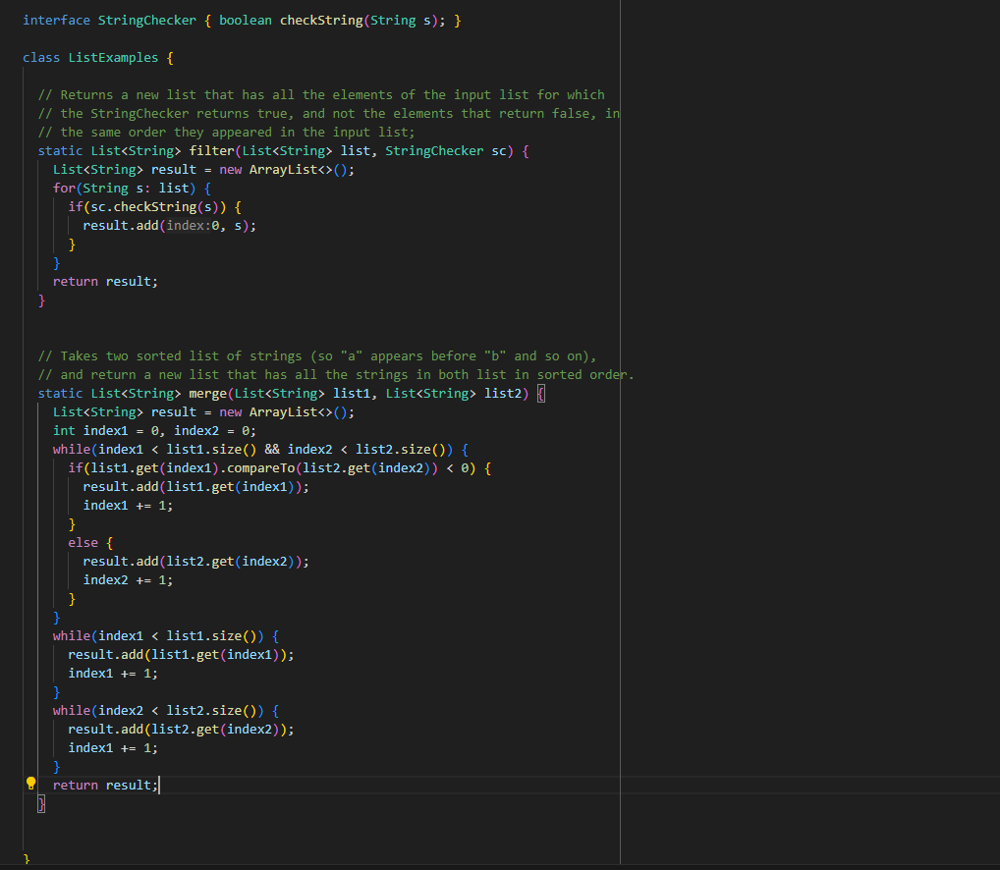

# Part 1
## Edstem Post
 \
Hi, I had an error with my ListExamples.java, as I tried to test to make sure it was working, but I got a TestTimedOutException. I'm not sure what error is what causing this, though I suspect its something to do with my loop.
My code for the merge method that is here:
```
static List<String> merge(List<String> list1, List<String> list2) {
    List<String> result = new ArrayList<>();
    int index1 = 0, index2 = 0;
    while(index1 < list1.size() && index2 < list2.size()) {
      if(list1.get(index1).compareTo(list2.get(index2)) < 0) {
        result.add(list1.get(index1));
        index1 += 1;
      }
      else {
        result.add(list2.get(index2));
        index2 += 1;
      }
    }
    while(index1 < list1.size()) {
      result.add(list1.get(index1));
      index1 += 1;
    }
    while(index2 < list2.size()) {
      result.add(list2.get(index2));
      index1 += 1;
    }
    return result;
  }
```

## Edstem response
You are correct that something is wrong with your loop, since a time out means that your code is running out too long. From what I can see in your code, you should look inside of the 2 bottom loops, as your error is there. (Hint: Make sure you are incrementing the looped
value so you don't have a infinite loop!).

## Fixed output
 \
The bug was that index1 in the third while loop was not correctly incrementing index2, so the third loop was running infinitely. To fix it, you need to change the incrementing of index1 in loop 3 by makin it increment index2 instead. That way, the loop runs correctly
and doesn't run together.

## Summary
 \

 \
Change the second index1 in the third loop to index2 to fix the infinite loop that previously occurred.

